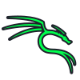

# 💼 My Technology & Cybersecurity Projects

Welcome to the section where I document security tests and tool usage.

<h2>

IT Support Projects
</h2>

[Active Directory Setup Project — Windows Server 2022](projects/ActiveDirectorySetupProject—WindowsServer2022.html)

<h2>

Azure Projects
</h2>

[ Azure Entra ID + RBAC Demo (Free Tier)](projects/AzureEntraID+RBACDemo.html)

---

<h2>

Kali Linux Projects
</h2>

[ WPScan – WordPress Vulnerability Audit](projects/wpscan.html)

---

<h2>

Networking Projects
</h2>

[ Small Business Network Simulation with Security and Attack Blocking](projects/CiscoPacketTracer.html)

---

[⬅️ Back to Home](index.html)
