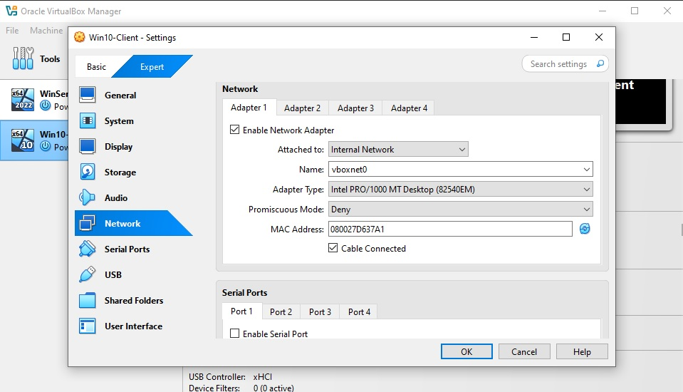
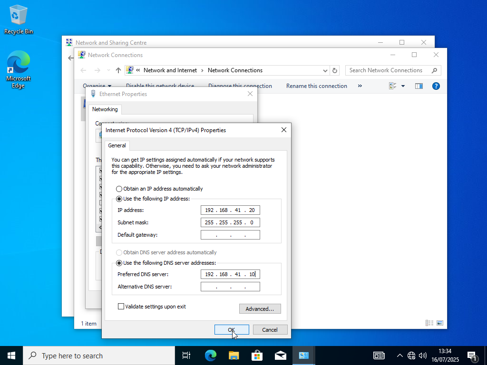
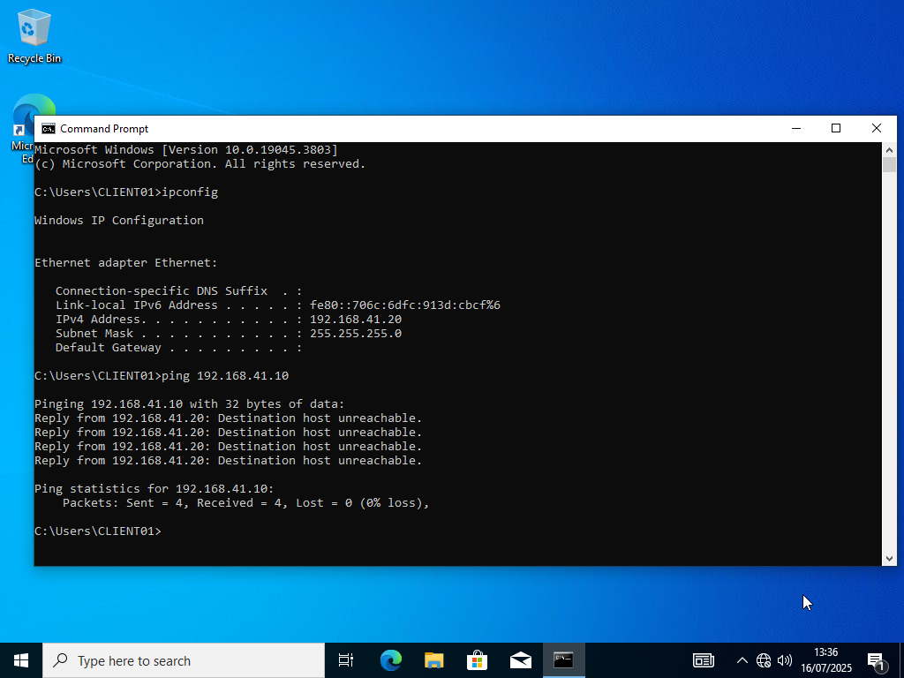

# 🖥️ Active Directory Lab – Joining Windows 10 Client to Domain

This lab demonstrates how to configure a Windows 10 client and join it to an existing Active Directory domain (`lab.local`) hosted on a Windows Server 2019 machine.

---

## ⚙️ Lab Environment

| Component           | Details                          |
|---------------------|----------------------------------|
| Virtualization      | VirtualBox                       |
| Network Type        | Host-Only Adapter (`vboxnet0`)   |
| Domain Name         | `lab.local`                      |
| Domain Controller   | SERVER01 – 192.168.41.10         |
| Windows 10 Client   | CLIENT01 – 192.168.41.11         |
| DNS Server          | 192.168.41.10                    |

---

## ✅ Steps

### 1. Create Windows 10 Virtual Machine

- Name: `CLIENT01`
- Edition: Windows 10 Education
- Allocate at least 2 GB RAM and 30 GB storage
- Use Windows 10 ISO for installation
- Set username: `LocalAdmin`
- Set password: `Client1234`

---

### 2. Configure Network in VirtualBox

- Go to `Settings` → `Network`  
  - Adapter 1 → **Host-Only Adapter**
  - Name: `vboxnet0`
  - Adapter Type: Intel PRO/1000 MT Desktop
  - Promiscuous Mode: Deny

 

### 3. Configure Static IP in Windows 10

- Open **Control Panel** → Network and Sharing Center  
- Click `Change adapter settings` → Right-click `Ethernet` → Properties  
- Choose **IPv4** → Properties → Enter:

IP Address: 192.168.41.11
Subnet Mask: 255.255.255.0
Default Gateway: 192.168.41.1 (optional)
Preferred DNS: 192.168.41.10 (DC address)

 

---

### 4. Rename Computer

- Win + R → `sysdm.cpl`
- Click `Change...` under Computer Name
- New name: `CLIENT01`
- Restart when prompted

---

### 5. Ping Domain Controller

Open Command Prompt:

ping 192.168.41.10
Expect 0% packet loss.

 

6. Join Domain
Win + R → sysdm.cpl → Computer Name → Change…

Select: Domain

Enter domain: lab.local

When prompted, enter:

Username: Administrator
Password: (as configured during AD install)

 

Success message: "Welcome to lab.local"

 

Restart required.

 

8. Log In as Domain User
After reboot:

At login screen → Click Other User

Enter:
Username: jkowalski
Password: Kowal1234
First login may take time due to profile creation.

 

📌 Summary
In this lab we:

✅ Installed and configured Windows 10 VM
✅ Set static IP and DNS for domain connectivity
✅ Renamed and joined the machine to domain lab.local
✅ Logged in successfully using a domain user account

This is a foundational setup for enterprise-style Active Directory environments, useful for testing GPOs, domain authentication, software deployment, etc.

