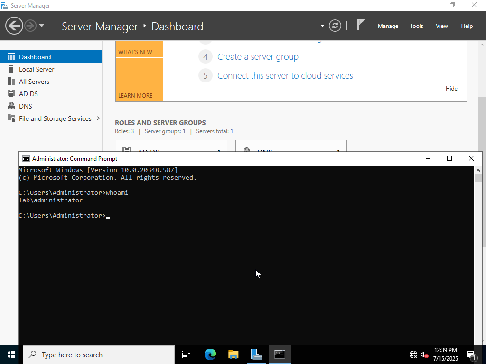
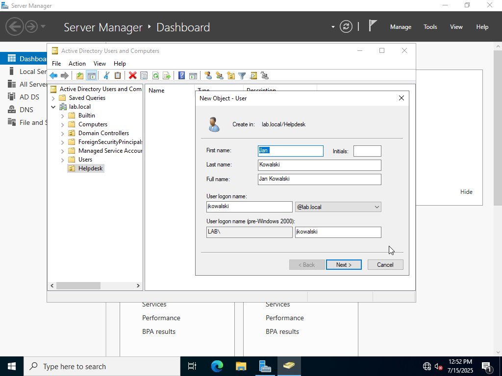
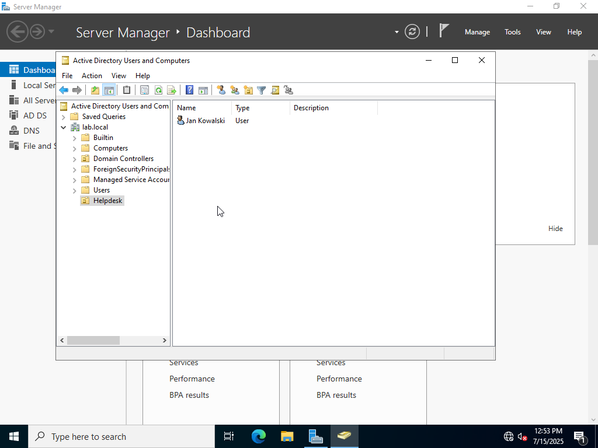
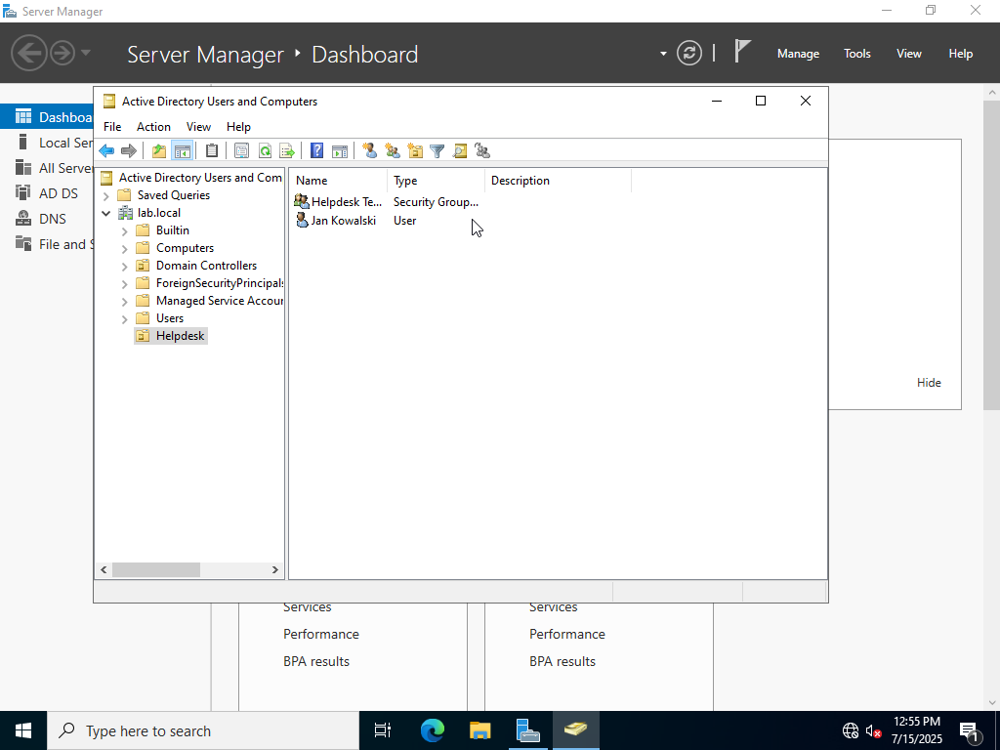

# 🧠 Active Directory Setup on Windows Server 2022 

This project demonstrates the installation and configuration of Active Directory Domain Services (AD DS) in a virtualized lab environment using **Oracle VirtualBox**.

The goal was to simulate a small enterprise Active Directory setup using Windows Server 2022, allowing for hands-on experience with:
- Domain controller deployment
- Organizational Unit (OU) design
- User and group creation
- Role-based access control
## All tasks were performed on a **virtual machine** created and configured locally, using a clean ISO of Windows Server 2022.
---
## 🎯 Objective

The goal is to create a simple domain-based infrastructure to showcase basic knowledge of:

- Active Directory Domain Services (AD DS)
- Domain controller configuration
- Creating and managing users, groups, and OUs
- Role-based group memberships

---

## 🛠️ Environment

| Component | Details |
|----------|---------|
| OS | Windows Server 2022 |
| Server Name | `SRV-DC01` |
| Static IP | `192.168.1.10` |
| Domain | `lab.local` |
| Administrator | `LAB\Administrator` |
| User | `jkowalski` (Password: `Kowal1234`) |

---

## 🔧 Setup Steps

### 1. Initial Server Configuration

- Set static IP, hostname, and time zone
- Rename server to `SRV-DC01`
- Reboot after network changes

<p align="center">

</p>
---
<p align="center">

</p>
---
<p align="center">

</p>

### 2. Install AD DS Role

- Open Server Manager → Add Roles and Features
- Select `Active Directory Domain Services`
- Proceed with installation

<p align="center">

</p>
---
<p align="center">

</p>
---
### 3. Promote Server to Domain Controller

After installing the "Active Directory Domain Services" role, the server needs to be promoted to a Domain Controller.

🧭 Steps:

1. In **Server Manager**, click the **flag icon** (⚠️ in top bar) → select **"Promote this server to a domain controller"**.

<p align="center">

</p>
---
2. In the **Deployment Configuration** step:
   - Select: `Add a new forest`
   - Root domain name: `lab.local`
   
<p align="center">

</p>
---
3. In the **Domain Controller Options** step:
   - Leave default options checked: `Domain Name System (DNS)` and `Global Catalog (GC)`
   - Set the **Directory Services Restore Mode (DSRM)** password (you’ll need this for recovery scenarios)

<p align="center">

</p>
---

4. Click **Next** through the remaining configuration steps (NetBIOS name, paths, review)

5. At the **Prerequisites Check** step:
   - Wait for validation to complete (warnings are OK)
   - Click **Install**

<p align="center">

</p>
---
6. The server will automatically **reboot** after promotion.

7. After reboot, log in using domain credentials:
   - Username: `LAB\Administrator`
   - Confirm login via `whoami` in CMD:
     ```cmd
     whoami
     ```
     Should output:
     ```
     lab\administrator
     ```
<p align="center">

</p>
---
<p align="center">

</p>
---
### 4. Create Organizational Unit

- Open **Active Directory Users and Computers**
- Right-click domain → New → Organizational Unit
- Name: `Helpdesk`

<p align="center">

</p>
---
<p align="center">

</p>
---


### 5. Create User `jkowalski`

- Inside `Helpdesk` OU → New → User
- Name: Jan Kowalski, Username: `jkowalski`
- Password: `kowal1234`  
  ⬜ Uncheck "User must change password at next logon"

<p align="center">

</p>
---
<p align="center">

</p>
---


### 6. Create Security Group

- Inside `Helpdesk` OU → New → Group
- Name: `Helpdesk Team`, Type: Security, Scope: Global

<p align="center">

</p>

---

### 7. Add User to Group

- Open group properties → Members → Add `jkowalski`
- Confirm membership

<p align="center">

</p>

---

📌 Summary
This project showcases a foundational Active Directory (AD) environment built on Windows Server 2022. Throughout the setup, key administrative concepts were applied, including:

Deploying a domain controller and creating a new AD forest (lab.local)

Installing and configuring the Active Directory Domain Services (AD DS) role

Creating Organizational Units (OUs) to logically structure domain resources

Adding users and groups to manage access and permissions through role-based access control

Verifying domain login using domain credentials (LAB\Administrator, jkowalski)

This hands-on lab reflects real-world IT administration tasks and helps demonstrate essential skills in directory services, user/group management, and Windows Server environments.


