# 🔐 Azure Entra ID + RBAC Demo (Free Tier)

This project demonstrates practical usage of Microsoft Entra ID (formerly Azure AD) and Azure Role-Based Access Control (RBAC), all using the free Azure account. It simulates real-world identity and access management in a cloud environment.

## 🚀 Goals

- Learn to manage users and groups in Microsoft Entra ID
- Apply RBAC to control access to Azure resources
- Simulate least-privilege access with a test user
- Showcase practical cloud IAM concepts in a portfolio-friendly way

---

## 🧩 Step-by-step Summary

### ✅ Step 1: Created a Test User
- Added `testuser` to Microsoft Entra ID
- Used manual password reset for controlled login
  

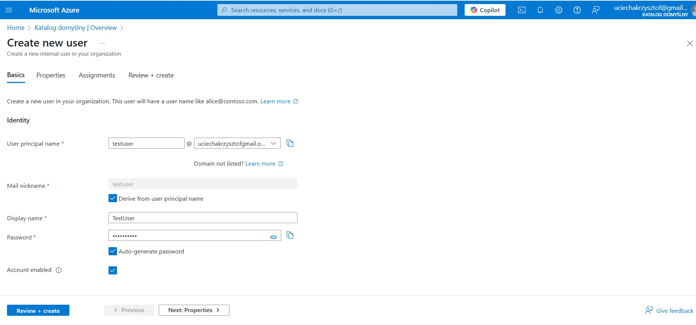

### ✅ Step 2: Created Security Groups
- Groups: `Admins`, `Developers`
- Assigned:
  - `testuser` → Developers
  - My global admin → Admins

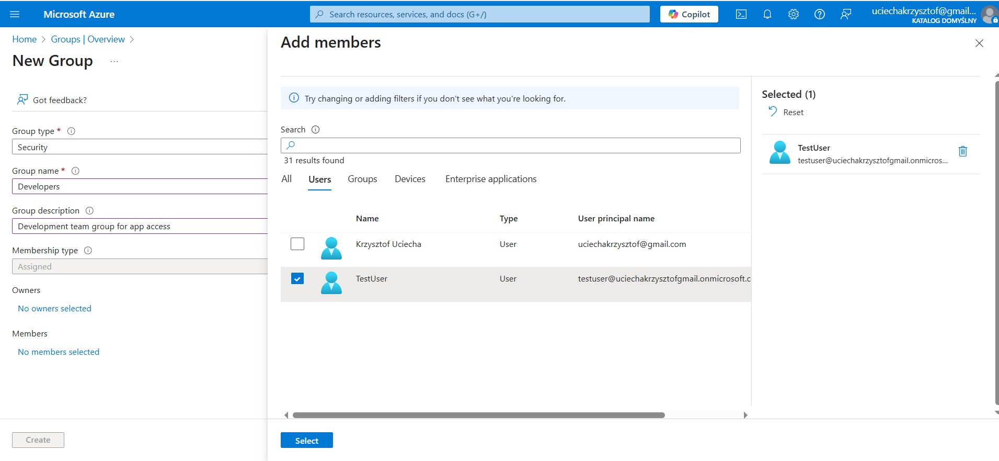

---

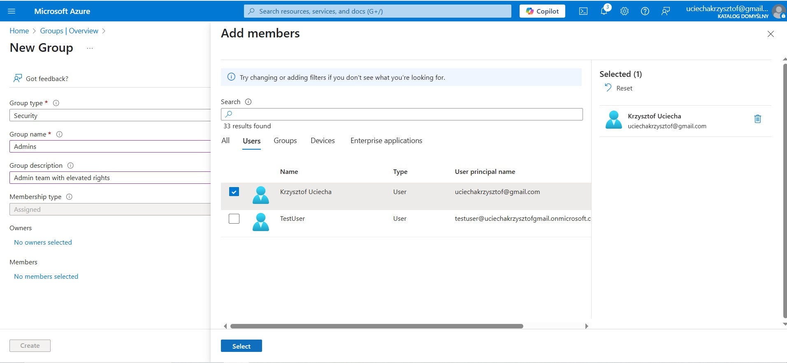

### ✅ Step 3: Assigned Azure RBAC Role
- Role: `Reader` assigned to `Developers` at subscription level
- This allowed all group members to view (but not change) Azure resources

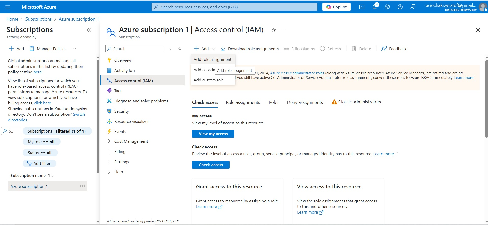

---

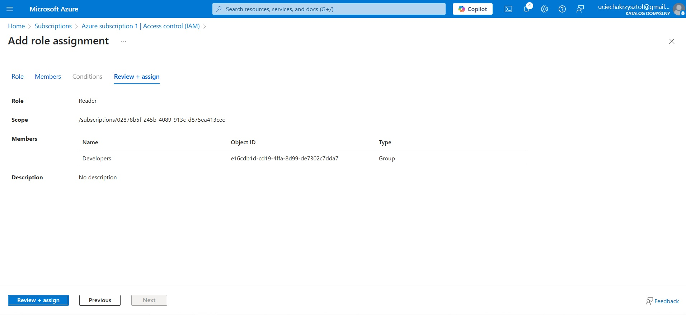

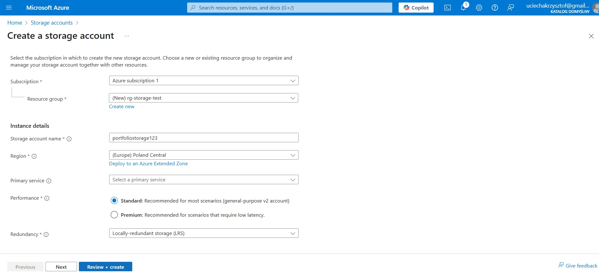

 your subscription > **Access control (IAM)**
- Assigned role `Reader` and `Storage Blob Data Reader` to group `Developers`
- This allowed members to view storage accounts and access blobs

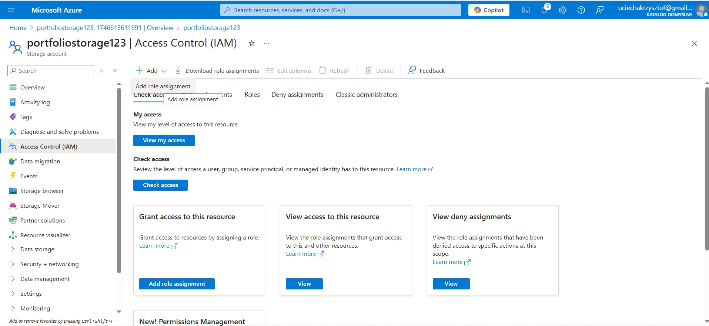

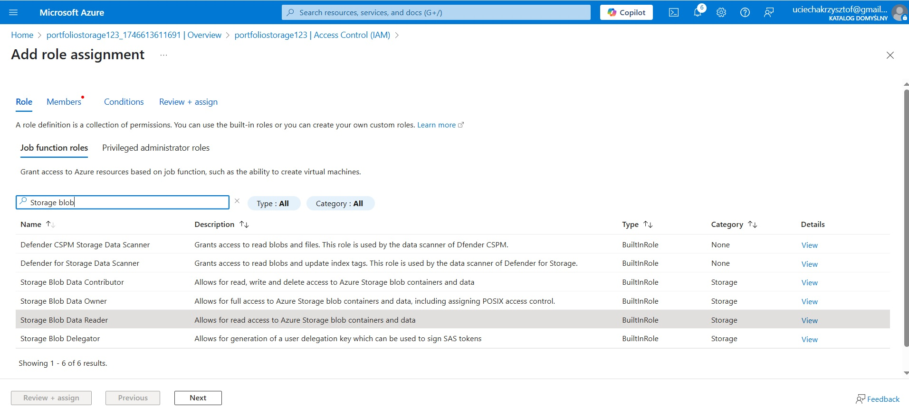

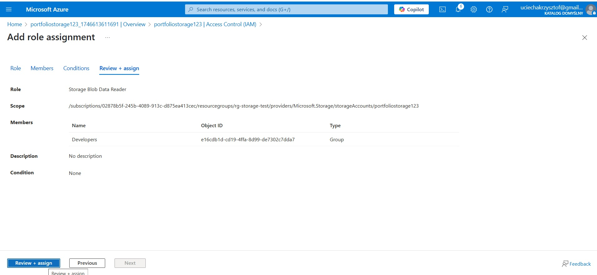

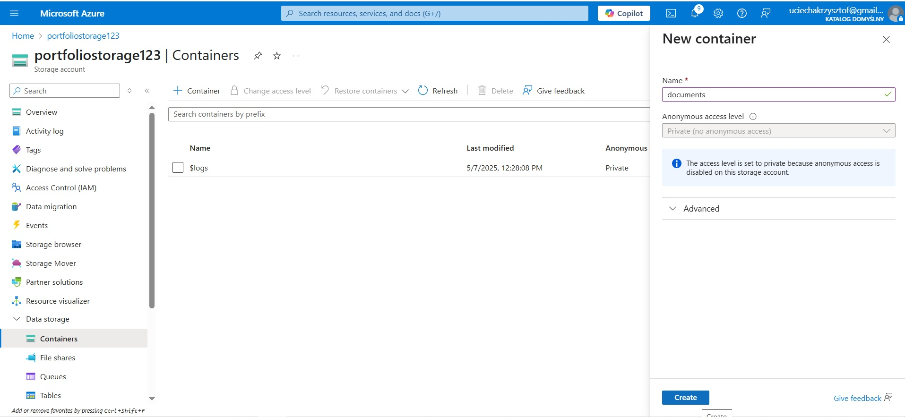

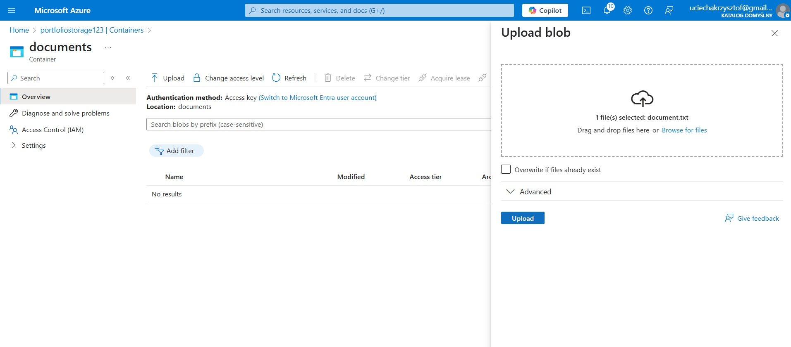

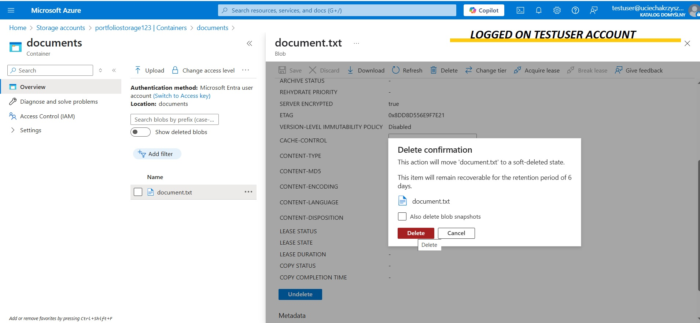

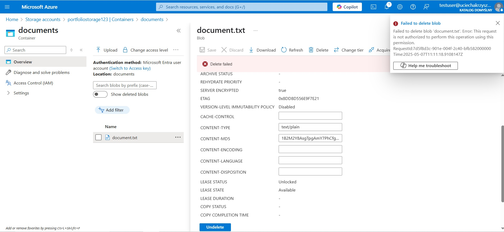
</p

---

## 👤 Test Scenario

- **Logged in as testuser**
- Verified access to storage
- Failed attempt to delete blob confirmed RBAC restrictions were enforced

---

---

## 🧠 Key Concepts Demonstrated

- Microsoft Entra ID user/group management
- Azure RBAC: roles, scopes, assignments
- Principle of least privilege
- Real-world cloud identity simulation — all on the free tier

---

## 📦 Tools Used

- Azure Portal (Free Tier)
- Microsoft Entra ID (formerly Azure AD)
- Azure Storage Account
- Azure RBAC

---

