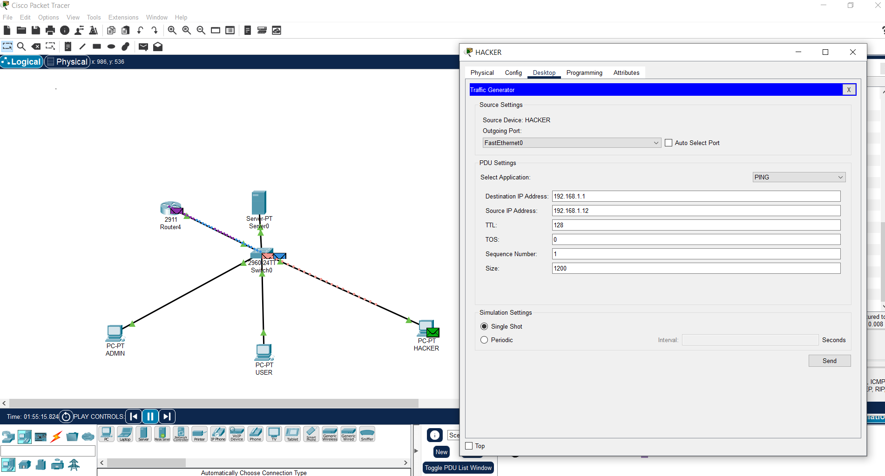

# 🔐 Small Business Network Simulation with Security and Attack Blocking (Cisco Packet Tracer)

## 🧩 Project Overview

This project demonstrates a simple business network topology built in Cisco Packet Tracer. It includes basic security configurations such as:

- Static IP addressing
- Remote SSH access to the router
- Detection of a simulated DoS attack
- Blocking the attacker's computer using an Access Control List (ACL)

---
### IP Addressing:

| Device        | IP Address       | Role               |
|---------------|------------------|--------------------|
| PC1  ADMIN    | 192.168.1.10     | Regular user       |
| PC2  USER     | 192.168.1.11     | Regular user       |
| PC3  HACKER   | 192.168.1.12     | Simulated attacker |
| Router G0/0   | 192.168.1.1      | Default gateway    |

---

## ⚙️ Router Configuration

### 1. Basic settings:

- enable
- configure terminal
- hostname xfunofearRouter
- ip domain-name xfunofear.com

### 1. Assign Static IPs to All PCs

- Go to **Desktop > IP Configuration** on each PC.
- Assign static IPs as listed above.
- Set the default gateway to `192.168.1.1` (router interface).
  

### 2. Configure LAN Inteface
- interface GigabitEthernet0/0
- ip address 192.168.1.1 255.255.255.0
- no shutdown

### 3.Enable SSH
username admin privilege 15 secret haslo123
crypto key generate rsa
Choose 1024-bit keys
ip ssh version 2
line vty 0 4
transport input ssh
login local

## Simulating a DoS Attack
Using the Built-in Traffic Generator on PC3 HACKER
To simulate an attack:

Go to PC3 > Desktop > Traffic Generator

Set the destination IP to 192.168.1.1 (the router)
Set the Source IP Adress to : 192.168.1.12

Adjust the settings:

Protocol: ICMP

TTL: 128

ToS: 0

Sequence Number: 1

Packet Size: 1200 bytes

Click SEND – this simulates a flood of ICMP packets (a basic DoS attack).

### Detecting the Attack
During simulation mode, the router receives unusually high ICMP traffic from PC3 (192.168.1.12). This is identified as a Denial of Service (DoS) attempt.

## Responding: Blocking the Attacker Using ACL

### 1.  Log in to the Router via Terminal 

Click on the router → CLI

Enter: enable
enter your enable password (haslo123).

### 1: Create an ACL

access-list 100 deny ip host 192.168.1.12 any
access-list 100 permit ip any any

### 2. Apply ACL to the Router Interface

interface GigabitEthernet0/0
ip access-group 100 in

## Testing and Results
From PC3 (Hacker):
ping 192.168.1.1
Result: 100% packet loss – communication blocked

